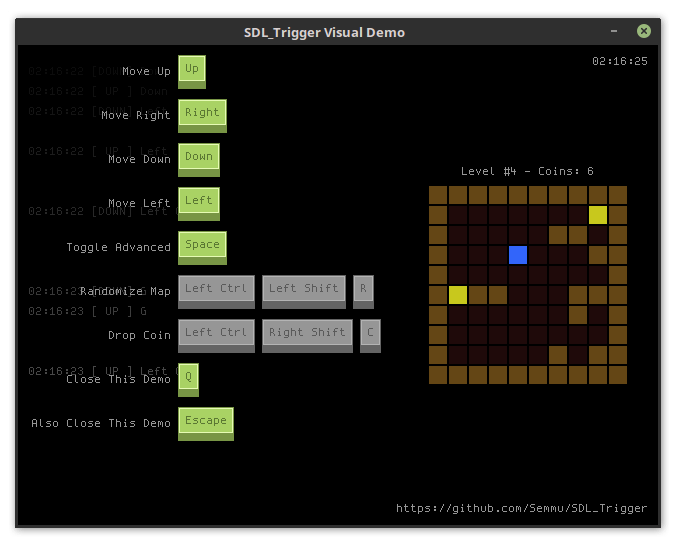

# SDL_Trigger

**Super easy-to-use keyboard shortcut library for SDL2.**



Just define your keyboard shortcuts with the corresponding callbacks and let SDL_Trigger handle the rest!

## Features:

 * Super easy-to-use
 * Handles single key and compound keyboard shortcuts
 * Can handle any type of callback that [`std::function`](https://en.cppreference.com/w/cpp/utility/functional/function) supports

## Requirements

 * SDL2 development packages
 * C++11 enabled compiler

## How To Use

**0. Add to your project:**

Copy the `include/sdl_trigger.h` and `src/sdl_trigger.cpp` files into your project directory, configure your IDE/build system/etc. to compile and link the necessary files, and `#include "sdl_trigger.h"` where you want to use it.

**1. Define your keybindings:**

Single key shortcut:
```cpp
Trigger::on(SDLK_LEFT, [&player]() {
    std::cout << "Left pressed, moving player left." << std::endl;
    player.moveLeft();
});
```

Compound shortcut:
```cpp
Trigger::on({SDLK_RCTRL, SDLK_a}, [&items]() {
    std::cout << "(Right)Ctrl + A pressed, selecting all items." << std::endl;
    items.selectAll();
});
```

(The second parameters with the syntax `[](){}` used here are [C++11 lambda functions,](https://en.cppreference.com/w/cpp/language/lambda) but other types of callbacks are supported as well. More details below.)

**2. Pass `SDL_Event`s to SDL_Trigger:**

In your event loop:
```cpp
while (SDL_PollEvent(&e) != 0)
{
    Trigger::processEvent(e);

    // ...
}
```

**3. Profit!**

SDL_Trigger maintains an internal state of your shortcuts and the keys pressed, and whenever a keyboard shortcut is fulfilled, SDL_Trigger calls the provided callback.

## Types of keyboard shortcuts

Right now SDL_Trigger supports 2 types of shortcuts: single key and compound ones.

 * **Single key shortcuts:**

   Just pass any key, like `SDLK_a` for `Trigger::on`, and every time that key is pressed, the callback will be called.

 * **Compound key shortcuts:**

   You can pass an arbitrary long list of `SDL_Keycode`s for `Trigger::on`, eg. `{SDLK_RCTRL, SDLK_RSHIFT, SDLK_SPACE}`, and it will call the callback **every time those keys are pressed in any order, but without other keys.** That means no other key is allowed to be pressed during the process, because that will invalidate the shortcuts' state and the callback won't be called. But the order of the pressed keys in the shortcut does not matter. So when you are holding down every key of a shortcut doesn't necessarily mean that it is going to be activated, only if no other key was pressed during the process! (There is a visual demo provided, play with it to see how it behaves.)

## Type of callbacks

SDL_Trigger only supports one type of callback:

```cpp
using Callback = std::function<void(void)>;
```

That means only functions with `void` return type and no arguments are supported. If you want to call functions with arguments, you could use [`std::bind`](https://en.cppreference.com/w/cpp/utility/functional/bind) or simply define a lambda and do anything you want in it, eg. call other functions with parameters.

Some examples:
  
 * **Calling a global function:**
 
   ```cpp
   void globalFunction() {
       std::cout << "global function called." << std::endl;
   }

   Trigger::on(SDLK_g, globalFunction);
   ```

 * **Calling a lambda:**
 
   ```cpp
   Trigger::on(SDLK_l, []() {
       std::cout << "lambda called." << std::endl;
   });
   ```

   (Of course this lambda could capture any variable or object from the outside.)

 * **Calling a functor:**
 
   ```cpp
   // the functor type
   struct Functor_t {
       std::string someString;

       Functor_t(std::string string) : someString{string} {
           // nothing
       }

       void operator()(void) {
           std::cout << "Functor called with someString = " << someString << std::endl;
       }
   };
   
   // the functor instance
   Functor_t aFunctor("A functor");

   // calling it on keypress
   Trigger::on(SDLK_f, aFunctor);
   ```

   A functor is just an object which has the `operator()` defined. [Click for an article about functors.](https://www.cprogramming.com/tutorial/functors-function-objects-in-c++.html)
   
 * **Calling an object method:**
 
   ```cpp
   // the functor type
   struct Object {
       std::string someString;

       Object(std::string string) : someString{string} {
           // nothing
       }

       void printString(void) {
           std::cout << "Object printing string, someString = " << someString << std::endl;
       }
   };
   
   // the functor instance
   Object anObject("Hi, I'm an object");

   // calling it on keypress
   Trigger::on(SDLK_f, [&anObject]() {
       anObject.printString();
   });
   ```
   
   The important piece here is to capture the object (by reference for better performance) while defining the lambda function.

There are other ways to define callbacks, for example using [`std::bind`](https://en.cppreference.com/w/cpp/utility/functional/bind), but the simplest method is just to define a lambda with no arguments and no return value, and do anything you want inside that lambda.

## Visual Demo

The visual demo provided (gif above) shows the behaviour of the library when pressing single or compound keyboard shortcuts. It contains a simple "maze" with yellow "coins" in it, and the blue colored "player" can be controlled with the arrow keys to collect the "coins." In the background a simple log of the keypresses is scrolling. The keyboard shortcuts are visible on the screen with the buttons also being pressed if the corresponding key is physically down (and the shortcut is not invalidated).

**Requirements:**

 * This demo requires the SDL2_ttf development packages as well
 
**Building and running:**

 * Build: `make`
 * Run: `make run` or execute `./bin/demo`

## TODO

 * **Key combination grouping to enable/disable triggers.**
 
   This should make it possible to use different keybindings in different application states (for example in the main menu, in the game, etc.) You could define multiple trigger groups for your application states and enable/disable them when needed.
 
 * **Handling of generic modifier keys without specifying which side (left or right) it is on.**
 
   Right now, since SDL_Trigger is based on the built-in `SDL_Keycode` type, there is no way to define a generic keyboard shortcut with for example simply the Control button, no matter which side it is on. If you want to support both Control buttons, you need to define a trigger with `SDLK_LCTRL` and `SDLK_RCTRL` as well. It sucks and SDL_Trigger should somehow define new types or values for these modifier keys and handle it internally.
 
 * **Shortcut reset on press.**
 
   This should make it possible to "reset" a keyboard shortcut if it's activated, so every key in it should have to be released and pressed again for its next activation. (You couldn't just spam one key and activate the compound shortcut again.)

 * **Repeating shortcuts.**
 
   This should make it possible to tell SDL_Trigger to process repeating keypresses when holding down a key and call callbacks if needed.

 * **Strict keypress order mode.**
 
   This should make it possible to only activate keyboard shortcuts if the keys were pressed in the exact same order as the trigger is defined.

(For the last three items a flag system could be used, a third parameter for `Trigger::on` could be `OR`'d flags to define behaviour.)

## License

MIT.